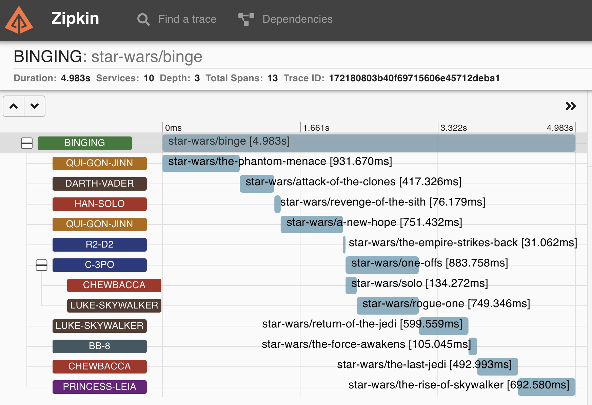

# calip(er)

measuring, tracing and debugging functions on demand _**without**_ a need to alter the code

[](https://github.com/tolitius/calip/releases)
[](https://clojars.org/tolitius/calip)

- [what does it do?](#what-does-it-do)
- [performance on demand](#performance-on-demand)
- [taming runtime errors](#taming-runtime-errors)
  - [measuring on error](#measuring-on-error)
- [reporting](#reporting)
  - [custom reporting](#custom-reporting)
  - [custom reports on errors](#custom-reports-on-errors)
- [µ/trace them!](#%C2%B5trace-them)
  - [input arguments](#input-arguments)
  - [respect the context](#respect-the-context)
  - [reveal the beauty](#reveal-the-beauty)
- [match and wrap many functions](#match-and-wrap-many-functions)
- [wrap them in anything](#wrap-them-in-anything)
  - [stacking wrappers](#stacking-wrappers)
  - [what is wrapped?](#what-is-wrapped)
  - [things to know](#things-to-know)
- [license](#license)

## what does it do?

calip _measures_, _traces_, and _debugs_ functions on demand, or in case of an error..<br/>
:sunglasses: _**without**_ a need to alter the code

it comes really handy at development time, as well as for deployed applications:

* when you need _on demand_ performance metrics with runtime arguments
* when you need to trace a sequence of functions called
* when you need to see the actual runtime function arguments in case of an error
* when you need to see the actual runtime function arguments as the program is running

in which case you can just connect to a deployed application via an `nREPL`, and add measurements, traces, logs to _any_ :mag_right: "functional suspect".

## performance on demand

let's pretend we have an app with two functional suspects:

> _if playing from the calip source dir you can:<br/>$ make repl_

```clojure
=> (defn rsum [n] (reduce + (range n)))
#'user/rsum
=> (defn rmult [n] (reduce *' (range 1 n)))
#'user/rmult

=> (rsum 10)
45
=> (rmult 10)
362880
```

now let's measure them:

```clojure
=> (require '[calip.core :as calip])

=> (calip/measure #{#'user/rsum
                    #'user/rmult})

=> (rsum 10)
"#'user/rsum" args: (10) | took: 13,969 nanos | returned: 45
45

=> (rmult 10)
"#'user/rmult" args: (10) | took: 16,402 nanos | returned: 362880
362880
```

`(10)` here shows the runtime arguments to a function that is measured, or "an" argument in this case.

these measurements can be removed of course:

```clojure
=> (calip/uncalip #{#'user/rsum})

=> (rsum 10)
45
=> (rmult 10)
"#'user/rmult" args: (10) | took: 17,479 nanos | returned: 362880
362880
```

or remove it from both:

```clojure
=> (calip/uncalip #{#'user/rsum #'user/rmult})

=> (rsum 10)
45
=> (rmult 10)
362880
```

> _alternitevely all functions that are wrapped via calip can be removed with:_
> ```clojure
> => (calip/uncalip (calip/wrapped))
> remove :measure wrapper from #'user/rmult
> remove :measure wrapper from #'user/rsum
> ```

## taming runtime errors

most of the time, in case of a runtime error/exception, JVM reports an array of stack trace elements, each representing one stack frame. This array is also known as a stacktrace.

while it is immensely useful for tracking down an error scope (i.e. _where_ it happened), it falls short to provide a _state_ snapshot at the time an error occurred: i.e. "what were the arguments passed to a function _at the time_ the error occurred?"

`calip` helps tracking down these runtime arguments by setting an "`:on-error?`" flag on a measurement.

### measuring on error

as an example let's take a function that creates a socket (i.e. connects) to external systems:

```clojure
=> (defn connect [{:keys [host port]}]
     (java.net.Socket. host port))
```
```clojure
=> (connect {:host "my-good-host.com" :port 7889})
#object[java.net.Socket 0x59cdc19b "Socket[addr=my-good-host.com/10.X.X.23,port=7889,localport=62446]"]

=> (connect {:host "8.8.8.8" :port 1025})

java.net.ConnectException: Operation timed out

=> (connect {:host "127.0.0.1" :port 1025})

java.net.ConnectException: Connection refused
```

in case of an error JVM reports an exception but there is no visual on what the arguments were at the time of this exception.

let's fix it _without a code change_ / on a running application:

```clojure
=> (calip/measure #{#'user/connect} {:on-error? true})
```

we can still normally connect without any extra logging / metrics:

```clojure
=> (connect {:host "my-good-host.com" :port 7889})
#object[java.net.Socket 0x3bc7a27c "Socket[addr=my-good-host.com/10.X.X.23,port=7889,localport=62446]"]
```

but in case of an error, in addition to the time a function took, `calip` will report the actual runtime args that led to this error:

```clojure
=> (connect {:host "8.8.8.8" :port 1025})
"#'user/connect" args: ({:host "8.8.8.8", :port 1025}) | took: 75,696,573,373 nanos | error: java.net.ConnectException: Operation timed out

java.net.ConnectException: Operation timed out
```

```clojure
=> (connect {:host "127.0.0.1" :port 22})
"#'user/connect" args: ({:host "127.0.0.1", :port 22}) | took: 309,753 nanos | error: java.net.ConnectException: Connection refused

java.net.ConnectException: Connection refused
```

> _`:on-error?` flag can be combined with a custom `:report` function that is documented in the next section_

## reporting

by default calip will use `println` and a "default format" as shown above to report metrics, but it is pluggable.<br/>
you can pass a report function to `calip/measure`. calip would pass a map to this function with:

```clojure
{:took took           ;; time this function took to execute in nanoseconds
 :fname fname         ;; function name with a namespace
 :args args           ;; arguments that were passed to this function
 :returned / :error}  ;; a :returned value or an :error [depending on whether the :on-error? flag is set]
```

quite a useful scenario is to use calip to measure or debug parts of the application that writes logs. We can tap into that:

```clojure
=> (require '[clojure.tools.logging :as log])

=> (calip/measure #{#'user/rsum #'user/rmult} {:report #(log/info (calip/default-format %))})

=> (rsum 10)
13:42:04.048 [nREPL-worker-24] INFO  user - "#'user/rsum" args: (10) | took: 14,928 nanos | returned: 45
45
=> (rmult 10)
13:42:07.687 [nREPL-worker-24] INFO  user - "#'user/rmult" args: (10) | took: 16,280 nanos | returned: 362880
362880
```

notice we used `(calip/default-format %)` to format that `{:took .., :fname .., :args .., :returned}` map, but you can of course customize it.

### custom reporting

```clojure
=> (defn create-life [{:keys [galaxy planet]}] "creating life...")
#'user/create-life
=>

=> (create-life {:galaxy "pegasus" :planet "athos"})
"creating life..."

=> (calip/measure #{#'user/create-life} {:report (fn [{:keys [took fname]}]
                                                   (log/info fname "took" took "ns"))})

=> (create-life {:galaxy "pegasus" :planet "athos"})
13:54:20.334 [nREPL-worker-25] INFO  user - #'user/create-life took 2637 ns
"creating life..."
```

or with args and return values:

```clojure
=> (calip/measure #{#'user/create-life} {:report (fn [{:keys [took fname args returned]}]
                                                   (log/info "\n|>" fname
                                                             "\n|> with args:" args
                                                             "\n|> took:" took
                                                             "ns \n|> return value:" returned))})

=> (create-life {:galaxy "pegasus" :planet "athos"})
INFO  user -
|> #'user/create-life
|> with args: ({:galaxy pegasus, :planet athos})
|> took: 2911 ns
|> return value: creating life...

"creating life..."
```

### custom reports on errors

a custom `:report` function can be combined with an `:on-error?` flag:

```clojure
user=> (calip/measure #{#'user/connect}
                      {:on-error? true
                       :report #(log/info (calip/default-format %))})

user=> (connect {:host "127.0.0.1" :port 22})
INFO  user - "#'user/connect" args: ({:host "127.0.0.1", :port 22}) | took: 339,019 nanos | error: java.net.ConnectException: Connection refused
```

or

```clojure
user=> (calip/measure #{#'user/rsum}
                      {:report #(log/info (calip/default-format %))
                       :on-error? true})

user=> (rsum "oops")
INFO  user - "#'user/rsum" args: ("oops") | took: 87,268 nanos | error: java.lang.ClassCastException: java.lang.String cannot be cast to java.lang.Number
```

## µ/trace them!

[µ/log](https://github.com/BrunoBonacci/mulog) is a great logging and tracing lib that can be used with calip instead of custom or built in reporting functions.

besides benefits of picking up µ/log's [context](https://github.com/BrunoBonacci/mulog#use-of-context) it will
also catch and report exceptions that would include duration and more tasty details.

in order to use µ/log, you would need to start one of the [publishers](https://github.com/BrunoBonacci/mulog#publishers).<br/>
for this example a console pretty publisher does it:

```clojure
=> (require '[com.brunobonacci.mulog :as µ])

=> (def pub (µ/start-publisher! {:type :console :pretty? true}))
#'user/pub
```

and now unleash the beast of [µ/trace](https://github.com/BrunoBonacci/mulog#%CE%BCtrace) with the `calip/trace` function.

let's define a couple of functions:

```clojure
=> (defn rsum [n] (reduce + (range n)))
#'user/rsum
=> (defn rmult [n] (reduce *' (range 1 n)))
#'user/rmult
```

and trace'em without them knowing (i.e. :gift: wrap them in µ/trace):

```clojure
=> (calip/trace #{#'user/rsum
                  #'user/rmult})
wrapping #'user/rsum in :trace
wrapping #'user/rmult in :trace

=> (rsum 10)
45
{:mulog/event-name :user/rsum,
 :mulog/timestamp 1666377944748,
 :mulog/trace-id #mulog/flake "4m-duM3W-Trkqocc7kDcxlHbhDwPPn5l",
 :mulog/root-trace #mulog/flake "4m-duM3W-Trkqocc7kDcxlHbhDwPPn5l",
 :mulog/duration 53261,
 :mulog/namespace "calip.core",
 :mulog/outcome :ok}
```

by default calip will use a function name for a `:mulog/event-name` key<br/>
since `µ/trace` takes a custom event name and other options, such as `:pairs`, `:capture`, etc..<br/>
we can pass all of it in a map of options:

```clojure
=> (calip/trace #{#'user/rsum
                  #'user/rmult} {:event-name ::calculator
                                 :pairs [:foo 42 :bar :zoo]
                                 :capture (fn [result] {:result-is result})})
wrapping #'user/rsum in :trace
wrapping #'user/rmult in :trace

=> (rmult 42)
33452526613163807108170062053440751665152000000000N
{:mulog/event-name :user/calculator,
 :mulog/timestamp 1666378105154,
 :mulog/trace-id #mulog/flake "4m-e2gb3DA5xsFXSLRUHLnypQGyQXELt",
 :mulog/root-trace #mulog/flake "4m-e2gb3DA5xsFXSLRUHLnypQGyQXELt",
 :mulog/duration 405866,
 :mulog/namespace "calip.core",
 :mulog/outcome :ok,
 :bar :zoo,
 :foo 42,
 :result-is 33452526613163807108170062053440751665152000000000N}
```

notice:

* `:foo` and `:bar` in a trace from `:pairs`
* `:mulog/event-name` is `:user/calculator`
* and the result is captured in `:result-is`

---
we can remove traces by `calip/untrace`:

```clojure
;; removing previous µ/trace(s):
=> (calip/untrace #{#'user/rsum #'user/rmult})
remove :trace wrapper from #'user/rsum
remove :trace wrapper from #'user/rmult
```


### input arguments

`calip/trace` can also take a `:format-args` option that, if provided, would format and add a function input arguments to the trace:

```clojure
=> (calip/trace #{#'user/rsum
                  #'user/rmult} {:format-args #(->> % first (str "meaning of life universe and everything: "))
                                 :pairs [:foo 42 :bar :zoo]
                                 :capture (fn [result] {:result-is result})})
wrapping #'user/rsum in :trace
wrapping #'user/rmult in :trace

=> (rmult 42)
33452526613163807108170062053440751665152000000000N
{:mulog/event-name :user/rmult,
 :mulog/timestamp 1666378492125,
 :mulog/trace-id #mulog/flake "4m-ePDEGgMb2Xq3PH-9C6FIUu2R37djV",
 :mulog/root-trace #mulog/flake "4m-ePDEGgMb2Xq3PH-9C6FIUu2R37djV",
 :mulog/duration 324314,
 :mulog/namespace "calip.core",
 :mulog/outcome :ok,
 :args "meaning of life universe and everything: 42",
 :bar :zoo,
 :foo 42,
 :result-is 33452526613163807108170062053440751665152000000000N}
```

notice the `:args` key 👆 in the trace, it reveals the meaning.

#### separate keys for arguments

by default the "`format-args`" function records all the arguments under "`:args`" in the trace.<br/>
however, if it returns **a map**, keys of this map are recorded _separately_ in a trace<br/>
similar to dynamic values in "pairs":

```clojure
=> (defn stargaze [constellation system star]
     (print "looking at stars.."))
```

```clojure
=> (calip/trace [#'user/stargaze] {:format-args (fn [[c cs s]]
                                                  {:arg/constellation c
                                                   :arg/system cs
                                                   :arg/star s})})
```

> _they don't need to be prefixed/namespaced with "`arg/`", this is just to visually group them together_

```clojure
=> (stargaze "centaurus" "alpha centauri" "toliman")
nil
looking at stars..
{:mulog/event-name :user/stargaze,
 :mulog/timestamp 1709917686018,
 :mulog/trace-id #mulog/flake "4ves6lMDdexpjqZ1h8pkiAYWw0f0FEda",
 :mulog/root-trace #mulog/flake "4ves6lMDdexpjqZ1h8pkiAYWw0f0FEda",
 :mulog/duration 39702,
 :mulog/namespace "calip.core",
 :mulog/outcome :ok,

 ;; here they are

 :arg/constellation "centaurus",
 :arg/star "toliman",
 :arg/system "alpha centauri"}
```

plug these values directly into James Webb Space Telescope, and...


### respect the context

if a global [context](https://github.com/BrunoBonacci/mulog#use-of-context) is set (by the µ/log) before or after measure is called, it will be included in the trace:

```clojure
=> (µ/set-global-context! {:app-name "sum and mult"
                           :version "0.1.0"
                           :env "local"})

user=> (rsum 10)
45
{:mulog/event-name :user/find-life,
 :mulog/timestamp 1666233540292,
 :mulog/trace-id #mulog/flake "4lyaZuV3b4QjLuE-lHOTvvObz5X0814O",
 :mulog/root-trace #mulog/flake "4lyaZuV3b4QjLuE-lHOTvvObz5X0814O",
 :mulog/duration 6651,
 :mulog/namespace "calip.core",
 :mulog/outcome :ok,
 :app-name "sum and mult",
 :bar :zoo,
 :env "local",
 :foo 42,
 :version "0.1.0"}
```

same applies for the local context (set by the µ/log) that is set at runtime, after measure was called:

```clojure
=> (µ/with-context {:who-am-i "calculator"}
     (rsum 10))
45
{:mulog/event-name :user/find-life,
 :mulog/timestamp 1666233724101,
 :mulog/trace-id #mulog/flake "4lyajbDBvVfWFZzeo8OkUeBzQxjgHiWY",
 :mulog/root-trace #mulog/flake "4lyajbDBvVfWFZzeo8OkUeBzQxjgHiWY",
 :mulog/duration 199814,
 :mulog/namespace "calip.core",
 :mulog/outcome :ok,
 :app-name "sum and mult",
 :bar :zoo,
 :env "local",
 :foo 42,
 :version "0.1.0",
 :who-am-i "calculator"}
```

### reveal the beauty

since functions can be traced with calip without them knowing it we can hook into any application and create beautiful visuals.

this example uses [zipkin](https://github.com/BrunoBonacci/mulog/tree/master/mulog-zipkin), but any tracing visual tool (grafana, jaeger, sleuth, kibana, etc.) can be used.

let's binge the [Star Wars episodes](dev/star_wars.clj) and see how long it would take us:

```clojure
=> (require '[com.brunobonacci.mulog :as μ]
            '[calip.core :as c]
            '[star-wars])

;; starting a different publisher that would send µ/trace output to zipkin
=> (μ/start-publisher!  {:type :zipkin
                         :url  "http://localhost:9411/"})
```

this example is contrived on purpose, usually it'd be something like "`#'foo.bar/find-*`" or "`#'foo.bar/baz`":

```clojure
=> (c/trace #{"#'star-wars/the-*"
              "#'star-wars/re*"
              "#'star-wars/a*"
              #'star-wars/one-offs
              #'star-wars/rogue-one
              #'star-wars/solo
              #'star-wars/binge})

wrapping #'star-wars/one-offs in :trace
wrapping #'star-wars/rogue-one in :trace
wrapping #'star-wars/the-force-awakens in :trace
wrapping #'star-wars/the-rise-of-skywalker in :trace
wrapping #'star-wars/a-new-hope in :trace
wrapping #'star-wars/attack-of-the-clones in :trace
wrapping #'star-wars/binge in :trace
wrapping #'star-wars/the-phantom-menace in :trace
wrapping #'star-wars/the-empire-strikes-back in :trace
wrapping #'star-wars/return-of-the-jedi in :trace
wrapping #'star-wars/solo in :trace
wrapping #'star-wars/the-last-jedi in :trace
wrapping #'star-wars/revenge-of-the-sith in :trace
```

ready to binge? let's do it!

```clojure
=> (star-wars/binge)
```



beauty unlocked :nerd_face:

all these Star Wars characters play a role of different "applications".

## match and wrap many functions

while profiling applications there are two questions that are very frequent:

> out of all these functions what _exactly_ takes so long?

and

> how long does _each function_ take in this module (namespace)?

instead of explicitly listing all the functions in a particular namespace, `calip` accepts strings in a:

* `"#'foo.bar/prefix-*"` format that would expand to include function names that starts with "`prefix-`" in a particular namespace
* `"#'foo.bar/*"` format that would expand to include all the functions in a particular namespace

for example wrap only functions in a `user` namespace that start with "`r`":

```clojure
user=> (calip/measure #{"#'user/r*"})
```
```clojure
wrapping #'user/rmult in :measure
wrapping #'user/rsum in :measure
```

or _all_ of the functions in the `user` ns:

```clojure
user=> (calip/measure #{"#'user/*"})
```

would wrap all the functions (values, macros, multimethods, etc. are skipped):

```clojure
skipping #'user/+version+ since it is not a function
wrapping #'user/check-sources in :measure
wrapping #'user/dev in :measure
wrapping #'user/log4b in :measure
wrapping #'user/rmult in :measure
wrapping #'user/rsum in :measure
```

i.e. it expands `"#'user/*"` into all the `'user` functions currently known to the runtime.

## wrap them in anything

`measure` and `trace` are just two built in wrappers.<br/>
calip can wrap functions in _any_ function (a.k.a. "[AOP](https://en.wikipedia.org/wiki/Aspect-oriented_programming) before/after/around advice") with `calip/wrap`.

the `wrap` takes:

* a function name (var)
* the function itself
* and its arguments:

```clojure
(fn [fname f & args]
 ;; ...
 )
```

and it is up to the this custom function (now the wrapper) whether to call the original / wrapped function, how many times, with which arguments, and what to return.

an example with `rsum` from above:

```clojure
=> (calip/wrap #{#'user/rsum}
               (fn [fname f & args]
                 (println "calling" fname "with" args)
                 (apply f args)))
wrapping #'user/rsum in :wrap

=> (rsum 10)
calling #'user/rsum with (10)
45
```

> [!NOTE]
> a wrapping function explicitly calls the original function `(apply f args)` and returns its result<br/>
> without it the original function is ("lost") never called and the wrapper would return `nil` by default


#### another example

you have a connect function (i.e. `#'user/connect`)<br/>
and we need to add a retry a flaky connection without touching the code.

we can write a wrapping function with a retry that _wraps_ the original function:

```clojure
=> (defn retry [fname f & args]
     (loop [attempt 1]
       (let [r (try (apply f args)
                    (catch Exception e
                      (if (< attempt 3) ::retry (throw e))))]
         (if (= r ::retry)
           (do (println fname "failed, attempt" attempt) (recur (inc attempt)))
           r))))
```

and wrap it with calip:

```
=> (calip/wrap #{#'user/connect}
               retry
               {:id :retry})       ;; optionally you can pass an id of the wrapper
wrapping #'user/connect in :retry
```

> [!NOTE]
> an optional `:id` can be passed to `calip/wrap` to identify a wrapper.<br>
> it can be used to remove a _specific_ wrapper later on

#### another example

you have a function that launches missiles (i.e. `#'user/launch-missiles`) and you want to short circuit it / don't call the function at all:

```clojure
=> (calip/wrap #{#'user/launch-missiles}
               (fn [fname f & args]
                 (println "not today:" fname args)
                 :aborted))
```


#### removing wrappers:

to remove all these wrappers, use `calip/unwrap`:

```clojure
=> (calip/unwrap #{#'user/rsum})
remove :wrap wrapper from #'user/rsum
```

### stacking wrappers

each wrapper has an id: `:measure`, `:trace`, `:wrap` (default for `calip/wrap`) or any custom `{:id ...}`.<br/>
wrappers with different ids stack, so a function can be measured, traced and retried at the same time:

```clojure
=> (calip/measure #{#'user/connect})
=> (calip/trace #{#'user/connect})
=> (calip/wrap #{#'user/connect}
               retry
               {:id :retry})
```

the last added wrapper is the outermost one: in the example above, `retry` calls `trace`, which calls `measure`, which calls `connect`.<br/>
wrapping again with the same id replaces that wrapper.

> _if the order of wrappers matters, compose them into a single wrapper:: hooks are kept in a map, so the order is only guaranteed for up to 8 wrappers per function_

a single wrapper can be removed by its id:

```clojure
=> (calip/unwrap #{#'user/connect}
                 {:id :retry})
remove :retry wrapper from #'user/connect
```

`untrace` only removes `:trace` wrappers, while `uncalip` / `unwrap` (without an `:id`) removes all calip wrappers.<br/>
hooks that are not added by calip (i.e. directly via robert.hooke) are left alone.

### what is wrapped?

```clojure
=> (calip/wrapped)
{#'user/connect #{:measure :trace :retry}
 #'user/rsum #{:wrap}}

;; remove them all
=> (calip/uncalip (calip/wrapped))
```

### things to know

* the wrapper _must_ call `(apply f args)` itself if the function should run
* only functions are wrapped: values, macros and multimethods are skipped
* code compiled with [direct linking](https://clojure.org/reference/compilation#directlinking) (`-Dclojure.compiler.direct-linking=true`) calls functions without going through vars, so wrappers won't be called (unless a function is marked `^:redef`)
* re-evaluating a function (i.e. `defn` or reloading a namespace) removes its wrappers, while `(calip/wrapped)` would still list them
* recursive functions that call themselves through the var run the wrapper/advice on every call

## license

Copyright © 2026 tolitius

Distributed under the Eclipse Public License either version 1.0 or (at
your option) any later version.
